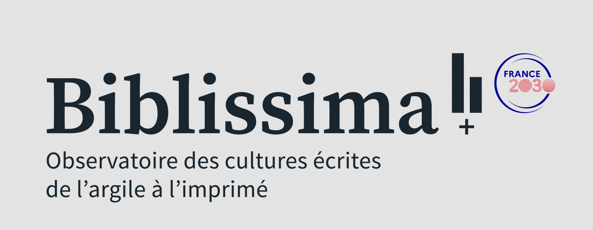

<!-- GitHub banner -->
<p align="center">
  
</p>

# 📖 Parallelium: an aligned scriptures dataset

> A multilingual corpus of aligned Biblical and Qur’anic texts — spanning medieval and modern languages — designed for computational and philological alignment tasks.  
> It serves as a benchmark dataset for multilingual alignment of historical religious texts.

> 📢 **Important Notice on Licensing**  
> This repository includes *only alignment metadata*. Some source texts (especially medieval Bible translations and parts of the Qur’anic corpus) are **not redistributed** due to licensing restrictions.  
> Please consult the documentation for access or citation of original sources.

## 📝 Description

*A multilingual dataset of aligned Biblical and Qur’anic texts, primarily in medieval languages, gathered from diverse external sources (see the 📂 Data Sources section). Selected modern editions are also included to enhance linguistic diversity and improve the robustness and generalizability of sentence alignment models.*

*The dataset is designed to support training and evaluation for historical, philological, and comparative linguistic applications.*


## 🎯 Project Scope

This dataset provides training data for multilingual alignment models. It includes over **48,000 aligned verses** and more than **4 million verse-level pairs**, covering **29 versions** in **9 languages**. The corpus spans both **medieval** and **modern** textual traditions.

It is intended as an **open and extensible training resource** for multilingual NLP — not a fixed benchmark. Future releases may include additional sources or metadata.

> 📌 Each aligned verse includes two or more versions. Pair counts reflect all _n choose 2_ language pairs per verse.

## 🌟 Goals and Audience

This dataset is designed to support the development and evaluation of **multilingual alignment models** tailored to historical texts — a domain often underserved by modern NLP resources.

Unlike standard parallel corpora, this dataset addresses challenges specific to historical-language contexts, including:

- Structural divergence across religious and textual traditions  
- Flexible or free word order in premodern languages  
- Non-standardized orthographies and inconsistent editorial practices  
- Gaps, mismatches, and overlaps in verse segmentation across versions  

By providing aligned data across a wide range of languages and periods, the corpus aims to:

- Enable **robust training** of alignment systems for historical and philological contexts  
- Support research on **translation shifts** and **textual transmission** across traditions  
- Serve as a **flexible foundation** for extended corpus-building, enrichment, or annotation  

### 🎯 Intended for:
- NLP researchers tackling low-resource or historical alignment  
- Digital humanists studying multilingual translation or textual variants  
- Scholars exploring transmission across religious and linguistic boundaries

## 📊 Dataset Overview

| Feature            | 📖 Biblia Corpus                                                                                   | 🕋 Qur’anic Corpus                                                                 |
|--------------------|---------------------------------------------------------------------------------------------------|------------------------------------------------------------------------------------|
| **Text Types**     | Biblical texts (medieval and selected modern editions)                                            | Qur’anic translations in historical European languages and Arabic                 |
| **Languages**      | Latin, French, English, Castilian, Catalan, Italian, Portuguese, Greek                            | Arabic, Latin, English, French, Italian                                           |
| **Alignment Unit** | Verse-level (approximating sentence or clause)                                                    | Verse-level (based on surah:ayah structure)                                       |
| **Format**         | JSON                                                                                              | JSON                                                                              |
| **Use Case**       | Training multilingual alignment models *(not for textual criticism)*                              | Training multilingual alignment models *(not for religious or exegetical use)*    |
| **Aligned Verses** | 42,562                                                                                            | 6,236                                                                             |
| **Aligned Pairs**  | 3,927,811                                                                                          | 114,226                                                                           |


# 📂 Data Sources

The Biblical and Qur’anic texts were selected for their **structural compatibility** — namely, their verse-based (or surah:ayah in the case of the Qur’an) organization — and their widespread **cross-linguistic transmission**, which enables meaningful alignment across centuries and traditions.


### 🕰️ Medieval Bibles

| Language | Text                        | Source                                                                                                                                                                           | Format        |
|----------|-----------------------------|----------------------------------------------------------------------------------------------------------------------------------------------------------------------------------|---------------|
| en       | John Wycliffe Bible         | [GitHub](https://github.com/saibotsivad/john-wycliffes-bible/tree/master/raw-text)                                                                                              | `.txt`        |
| en       | Coverdale Bible             | [GitHub](https://github.com/Isidore-Guild/coverdale)                                                                                                                             | `.xml`        |
| en       | Great Bible                 | [EDGeS Corpus](https://spraakbanken.gu.se/en/resources/openedges)                                                                                                                | `.tsv`        |
| it       | Gospel of St. Matthew       | [Caterina Menichetti Edition](https://www.sismel.it/pubblicazioni/2059-il-vangelo-secondo-matteo-in-volgare-italiano-studio-ed-edizione-critica-delle-due-versioni-non-glossate)            | `.pdf`        |
| fr       | La Bible historiale         | [Project site](https://www.biblehistoriale.fr/index.php/xml-tei/)                                                                                                                | `.xml`        |
| fr       | Esther, Judith, Ruth        |Texts kindly provided by Claudio Lagomarsini                                                                                                                                                | Word\*        |
| fr       | Gospel of Matthew           |Transcription kindly provided by Seth Middleton                                                                                                                                                | `.txt`\*      |
| gr       | Septuagint (LXX)            | [Corpus Corporum](https://mlat.uzh.ch/browser?path=/17098/17099/17113/17110/17104)                                                                                               | `.xml`        |
| es       | Three Medieval Bibles       | [Proyecto Biblia Medieval](https://bibliamedieval.es/recursos/textos)                                                                                                            | `.txt`        |
| ca       | Three Medieval Bibles       | Texts kindly provided by Pere Casanellas [(Corpus Biblicum Catalanicum)](https://cbcat.abcat.cat/)                                                                                                       | `.xml`, Word\*|
| la       | Vulgata Sixto-Clementina    | [GitLab](https://gitlab.com/crosswire-bible-society/vulgate/-/blob/master/vulgate.osis.xml?ref_type=heads)                                                                      | `.xml`        |

> \* *These texts are not publicly shareable due to copyright restrictions.*

---

### 📅 Modern Editions

Nine Bibles in French, English, Portuguese, Greek, and Spanish from [this repository](https://github.com/thiagobodruk/bible), used to augment language diversity.

---

### 🕋 Qur’an

Multilingual alignment produced by the **[Coran 12-21](https://coran12-21.org/fr) project** — co-directed by **Mouhamadoul-Khaly Wélé and Tristan Vigliano** — covering 7 languages (Arabic, Latin, English, French, Italian, etc.), with texts kindly provided by Mouhamadoul-Khaly Wélé.
*Note: This resource is not publicly redistributable.*

---
## 📁 Data Format

The dataset is stored in structured JSON files:

- **Monolingual format**: dictionary of `{book → list of {ref, text}}`
- **Multilingual format**: list of aligned verses, each with `book`, `ref`, and a `data` map of translations

➡️ See [docs/data_structure.md](docs/data_structure.md) for full examples and schema.

## 🔍 Alignment Preview (Biblical Corpus)

The snippet below illustrates how to explore aligned verse pairs in the JSON file.  
Each verse contains a `book`, `ref`, and a `data` dictionary mapping version IDs to verse translations.

```python
import json

with open("aligned_data.json") as f:
    data = json.load(f)

# Display all aligned French–Portuguese verse pairs from Genesis
# 💡 Change language IDs below based on your alignment interest
for verse in data:
    if verse["book"] == "genesis":
        fr = verse["data"].get("fr_lsegond")
        pt = verse["data"].get("pt_almeida")
        if fr and pt:
            print(f'{verse["ref"]}:\nFR: {fr}\nPT: {pt}\n')
```
Note: aligned_data.json is not distributed due to licensing.
Use this example to preview the data format and structure.

---


### 🔮 Future Directions

This corpus is an initial foundation intended to grow. Several improvements are planned to enhance its usability, accuracy, and scholarly value:

- Prioritize the **collection and structuring of additional medieval texts**, especially from **Romance-language traditions**, to rebalance the dataset—currently skewed toward modern sources—and progressively specialize it for historical modeling. This will improve alignment robustness for premodern domains and enable the training of models tailored to medieval textual data.

- **Incorporate OCR/HTR of manuscript texts**  
  Leveraging Optical Character Recognition (OCR) and Handwritten Text Recognition (HTR) will allow the inclusion of otherwise inaccessible sources, especially for underrepresented medieval texts not available in digital editions.

- **Annotate editorial provenance and textual lineage**  
  Metadata will be enriched to reflect the textual origin (e.g., manuscript family, editor, edition), enabling philological and stemmatic analysis across traditions.

- **Develop a queryable interface or API**  
  To support broader reuse and exploration, develop a queryable interface or lightweight CLI tool is under consideration, allowing users to search and extract aligned verses by book, chapter, language pair, or version — without requiring users to load the full dataset into memory

### 🗂️ Versioning

- **Current version**: `v0.1`  
- **Next planned update**: Continued cleaning and integration of additional medieval texts already sourced — targeted for **Q4 2025**

## 💰 Funding

This work benefited from national funding managed by the **Agence Nationale de la Recherche** under the *Investissements d'avenir* programme with the reference **ANR-21-ESRE-0005 (Biblissima+)**.

> Ce travail a bénéficié d'une aide de l’État gérée par l’**Agence Nationale de la Recherche** au titre du programme d’**Investissements d’avenir** portant la référence **ANR-21-ESRE-0005 (Biblissima+)**.





### 📜 License

The alignment metadata produced for this dataset are distributed under the [CC BY-NC-SA 4.0](https://creativecommons.org/licenses/by-nc-sa/4.0/) license, unless otherwise noted.

> ⚠️ Some **source texts**—particularly certain medieval Bible translations and portions of the Qur’anic corpus—are **not included** in this repository due to third-party copyright restrictions.  
> Please refer to the documentation or the original editions for licensing information on specific versions.
