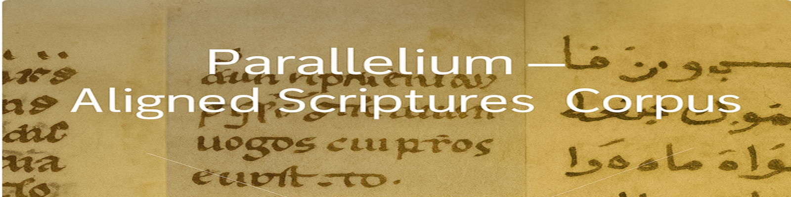

<!-- GitHub banner -->
<p align="center">
  
</p>

# 📖 Parallelium : an aligned scriptures dataset

> A multilingual corpus of aligned Biblical and Qur’anic texts — spanning medieval and modern languages — designed for computational and philological alignment tasks.  
> Serving as a benchmark dataset for multilingual alignment of historical religious texts.

## 📝 Description

*A multilingual dataset of aligned Biblical and Qur’anic texts, primarily in medieval languages, gathered from diverse external sources (see the 📂 Data Sources section). Selected modern editions are also included to enhance linguistic diversity and improve the robustness and generalizability of sentence alignment models.*

*The dataset is designed to support training and evaluation for historical, philological, and comparative linguistic applications.*


## 🎯 Project Scope

This dataset provides training data for multilingual alignment models. It includes over **48,000 aligned verses** and more than **4 million verse-level pairs**, covering **29 versions** in **9 languages**. The corpus spans both **medieval** and **modern** textual traditions.

It is intended as an **open and extensible training resource** for multilingual NLP — not a fixed benchmark. Future releases may include additional sources or metadata.

> 📌 Each aligned verse includes two or more versions. Pair counts reflect all _n choose 2_ language pairs per verse.

## 🌟 Goals and Audience

This dataset is designed to support the development and evaluation of **multilingual alignment models** tailored to historical texts — a domain often underserved by modern NLP resources.

Unlike standard parallel corpora, this dataset addresses challenges specific to historical-language contexts, including:

- Structural divergence across religious and textual traditions  
- Flexible or free word order in premodern languages  
- Non-standardized orthographies and inconsistent editorial practices  
- Gaps, mismatches, and overlaps in verse segmentation across versions  

By providing aligned data across a wide range of languages and periods, the corpus aims to:

- Enable **robust training** of alignment systems for historical and philological contexts  
- Support research on **translation shifts** and **textual transmission** across traditions  
- Serve as a **flexible foundation** for extended corpus-building, enrichment, or annotation  

### 🎯 Intended for:
- NLP researchers tackling low-resource or historical alignment  
- Digital humanists studying multilingual translation or textual variants  
- Scholars exploring transmission across religious and linguistic boundaries

## 📊 Dataset Overview

| Feature            | 📖 Biblia Corpus                                                                                   | 🕋 Qur’anic Corpus                                                                 |
|--------------------|---------------------------------------------------------------------------------------------------|------------------------------------------------------------------------------------|
| **Text Types**     | Biblical texts (medieval and selected modern editions)                                            | Qur’anic translations in historical European languages and Arabic                 |
| **Languages**      | Latin, French, English, Castilian, Catalan, Italian, Portuguese, Greek                            | Arabic, Latin, English, French, Italian                                           |
| **Alignment Unit** | Verse-level (approximating sentence or clause)                                                    | Verse-level (based on surah:ayah structure)                                       |
| **Format**         | JSON                                                                                              | JSON                                                                              |
| **Use Case**       | Training multilingual alignment models *(not for textual criticism)*                              | Training multilingual alignment models *(not for religious or exegetical use)*    |
| **Aligned Verses** | 42,562                                                                                            | 6,236                                                                             |
| **Aligned Pairs**  | 3,927,811                                                                                          | 114,226                                                                           |


## 🔍 Challenges

### 🧩 Source Heterogeneity

- Modern Bibles are abundant online, but medieval ones are rare, sometimes only available in printed editions or inaccessible formats.
- Encoding inconsistencies and varying editorial norms require extensive normalization.

### ⚖️ Traditions and Variant Structures

- Medieval texts stem from diverse religious traditions, requiring careful textual literacy to align them responsibly.

- Canonical order and verse mapping vary significantly across traditions. Some books differ not only in name but also in structure — whether they are combined or split, reordered, expanded, or labeled differently across canons. These structural variations directly affect alignment decisions.

#### 🧱 Examples of Structural Differences

The following are just a few representative examples of structural differences that occur across traditions and directly impact how texts are aligned in the dataset:

- **Combined vs. Separate Books**
  - In the Latin Vulgate, *Ezra* and *Nehemiah* are titled *1 Esdras* and *2 Esdras*, respectively.
  - In the Septuagint, *1 Esdras* (*Esdras A*) is a distinct book that partially overlaps with *Ezra* and includes additional material (e.g., the "Three Bodyguards" story).
  - The Septuagint's *Ezra–Nehemiah* is presented as *2 Esdras* (*Esdras B*), aligning more closely with the Hebrew/Latin narrative but under a different naming system.

- **Additions and Rearrangements**
- *Daniel* includes additional materials — such as *Susanna*, *Bel and the Dragon*, the *Prayer of Azariah*, and the *Song of the Three Young Men* — which are present in both the Septuagint and the Latin Vulgate. However, their placement, chapter numbering, and structural treatment differ: for example, the *Prayer of Azariah* and the *Song* are inserted into Daniel 3 in the Septuagint, while the Vulgate includes them with separate headings and variable editorial presentation.

- **Different Chapter/Verse Divisions**
  - In some traditions, chapters or verses are split or merged differently (e.g., the *Epistle of Jeremiah* appears as **Baruch 6** in the Vulgate).
  - Psalm numbering varies across versions, complicating direct verse-to-verse comparison.

- **Supplemental or Non-Canonical Additions**
  - *Psalmus 151* is present in the Septuagint and in some later Latin Vulgate manuscripts, where it is occasionally labeled as apocryphal or appended outside the canonical Psalter. It has no standard position in the Latin tradition and is not consistently represented across witnesses.

- Even when books are nominally shared across traditions, structural divergences may prevent straightforward alignment.
  - ❗ Alignment in such cases requires detailed editorial work: verse splitting, content reordering, and managing interpolated sections. In some cases, texts may be excluded from alignment altogether if no counterpart exists in another tradition.


## 🛠️ Use and Limitations

⚠️ This dataset is intended **exclusively for training and evaluation purposes** in computational and philological contexts.

It does **not preserve canonical verse numbering** and is therefore **not suitable** for:

- Scholarly editions or critical apparatus  
- Canonical citation or religious reference  
- Fine-grained textual-critical research
## 🤔 Alignment Principles

The following principles define how this dataset is structured and aligned across traditions, based on the scope and goals outlined above.

---

### 🧭 Anchor Text

The **Latin Vulgate** serves as the primary alignment anchor due to its historical centrality and relatively stable verse structure.

- When a Vulgate version is unavailable for a specific verse or book, alignment is still performed using available language pairs from other traditions.
- In cases where a verse diverges (e.g., follows the Septuagint tradition), a modified reference is assigned (e.g., `"3:03"`) to distinguish it from the Vulgate-based verse (`"3:3"`). This approach preserves valuable content without requiring a Latin version.

**Example:**

```json
{
  "book": "nehemiae",
  "ref": "3:3",
  "data": {
    "la_vulgate": "portam autem Piscium aedificaverunt filii Asanaa ...",
    "gr_lxx": null,
    "en_wycliffe": "Forsothe the sones of Asamaa bildiden the yatis of fischis ...",
    "es_e6e8": "los fijos de assnaa fizieron la puerta delos peces ..."
  }
},
{
  "book": "nehemiae",
  "ref": "3:03",
  "data": {
    "la_vulgate": null,
    "gr_lxx": "καὶ τὴν πύλην τὴν ἰχθυηρὰν ᾠκοδόμησαν υἱοὶ Ασανα· ...",
    "en_coverdale": "But the Fyshporte dyd the children of Senaa buylde ...",
    "es_arragel": "& la puerta de los pesçes edeficaron los fiios de çanaa ..."
  }
}
```

### 🔗 Minimum Pairing Requirement

A verse is included **only if** it has at least **one aligned counterpart** in another language or tradition.

- Books or verses that appear in only one tradition are excluded (e.g., *IV Esdras* in the Vulgate, *1 Esdras* in the Septuagint, or *3–4 Maccabees* in the Greek canon).
- The dataset focuses strictly on **comparative alignment** between at least two witnesses.

---

### 🧱 Structural Exclusions

Books with **major structural divergence** are excluded when reliable verse mapping would require extensive manual effort.

- Example: the Septuagint version of *Esther* differs significantly from the Vulgate and other witnesses, and was therefore excluded for now.

---

### ✋ Manual Alignment Adjustments

To maintain alignment consistency across divergent textual traditions, some verses required **manual intervention**, such as:

- Splitting a verse across multiple references  
- Shifting a phrase to an adjacent verse to preserve structural correspondence  

These interventions are based **strictly on attested content** — never on reconstruction or editorial invention.

> All manual operations are documented separately to ensure transparency and reproducibility.


# 📂 Data Sources

The Biblical and Qur’anic texts were selected for their **structural compatibility** — namely, their verse-based (or surah:ayah in the case of the Qur’an) organization — and their widespread **cross-linguistic transmission**, which enables meaningful alignment across centuries and traditions.


### 🕰️ Medieval Bibles

| Language | Text                        | Source                                                                                                                                                                           | Format        |
|----------|-----------------------------|----------------------------------------------------------------------------------------------------------------------------------------------------------------------------------|---------------|
| en       | John Wycliffe Bible         | [GitHub](https://github.com/saibotsivad/john-wycliffes-bible/tree/master/raw-text)                                                                                              | `.txt`        |
| en       | Coverdale Bible             | [GitHub](https://github.com/Isidore-Guild/coverdale)                                                                                                                             | `.xml`        |
| en       | Great Bible                 | [EDGeS Corpus](https://spraakbanken.gu.se/en/resources/openedges)                                                                                                                | `.tsv`        |
| it       | Gospel of St. Matthew       | [Caterina Menichetti Edition](https://www.sismel.it/pubblicazioni/2059-il-vangelo-secondo-matteo-in-volgare-italiano-studio-ed-edizione-critica-delle-due-versioni-non-glossate)            | `.pdf`        |
| fr       | La Bible historiale         | [Project site](https://www.biblehistoriale.fr/index.php/xml-tei/)                                                                                                                | `.xml`        |
| fr       | Esther, Judith, Ruth        |Texts kindly provided by Claudio Lagomarsini                                                                                                                                                | Word\*        |
| fr       | Gospel of Matthew           |Transcription kindly provided by Seth Middleton                                                                                                                                                | `.txt`\*      |
| gr       | Septuagint (LXX)            | [Corpus Corporum](https://mlat.uzh.ch/browser?path=/17098/17099/17113/17110/17104)                                                                                               | `.xml`        |
| es       | Three Medieval Bibles       | [Proyecto Biblia Medieval](https://bibliamedieval.es/recursos/textos)                                                                                                            | `.txt`        |
| ca       | Three Medieval Bibles       | Texts kindly provided by Pere Casanellas [(Corpus Biblicum Catalanicum)](https://cbcat.abcat.cat/)                                                                                                       | `.xml`, Word\*|
| la       | Vulgata Sixto-Clementina    | [GitLab](https://gitlab.com/crosswire-bible-society/vulgate/-/blob/master/vulgate.osis.xml?ref_type=heads)                                                                      | `.xml`        |

> \* *These texts are not publicly shareable due to copyright restrictions.*

---

### 📅 Modern Editions

Nine Bibles in French, English, Portuguese, Greek, and Spanish from [this repository](https://github.com/thiagobodruk/bible), used to augment language diversity.

---

### 🕋 Qur’an

Multilingual alignment produced by the **[Coran 12-21](https://coran12-21.org/fr) project** — co-directed by **Mouhamadoul-Khaly Wélé and Tristan Vigliano** — covering 7 languages (Arabic, Latin, English, French, Italian, etc.), with texts kindly provided by Mouhamadoul-Khaly Wélé.
*Note: This resource is not publicly redistributable.*

---
## 📁 Data Format

The dataset is stored in structured JSON files:

- **Monolingual format**: dictionary of `{book → list of {ref, text}}`
- **Multilingual format**: list of aligned verses, each with `book`, `ref`, and a `data` map of translations

➡️ See [docs/data_structure.md](docs/data_structure.md) for full examples and schema.
