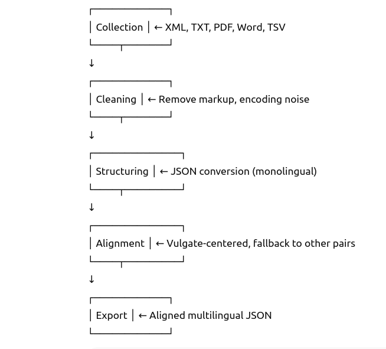

## ⚙️ Alignment Workflow (Biblical Corpus)

This document outlines the **preprocessing and alignment pipeline** used to construct the *Biblical* section of the **Parallelium** dataset.

The workflow supports heterogeneous source formats and prepares the data for multilingual **verse-level alignment**, centered—when possible—on the **Latin Vulgate**.

---

## 🔄 Overview

`Import ➝ Structure ➝ Filter ➝ Align (to Vulgate) ➝ Export`

  

---
> The dataset was constructed through a multi-stage pipeline, specifically designed to accommodate diverse source formats and the complexities of historical textual variation.

## 🧩 Pipeline Stages

1. **Collection**  
   - Source formats include XML, TXT, PDF, Word, and TSV  
   - Texts were selected for having existing verse-based divisions  
   - No orthographic normalization was performed — original spellings are preserved

2. **Cleaning**  
   - Removal of non-textual artifacts, markup noise, and encoding issues  
   - TEI/XML files were simplified or minimally processed for structure

3. **Structuring**  
   - Conversion into a unified JSON schema  
   - Monolingual JSON files prepared per text, then merged into multilingual alignment files  
   - Metadata added for book names, references, and version IDs

4. **Alignment**  
   - Verse-level alignment centered on the Latin Vulgate when available  
   - Where the Vulgate lacked a verse, alignment was constructed from available pairs  
   - Only verse units with at least one valid cross-language pair were retained

5. **Export**  
   - Final outputs include monolingual and multilingual JSON files  
   - Missing verses are represented with `null` values for transparency  

---
