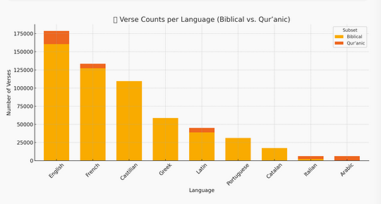
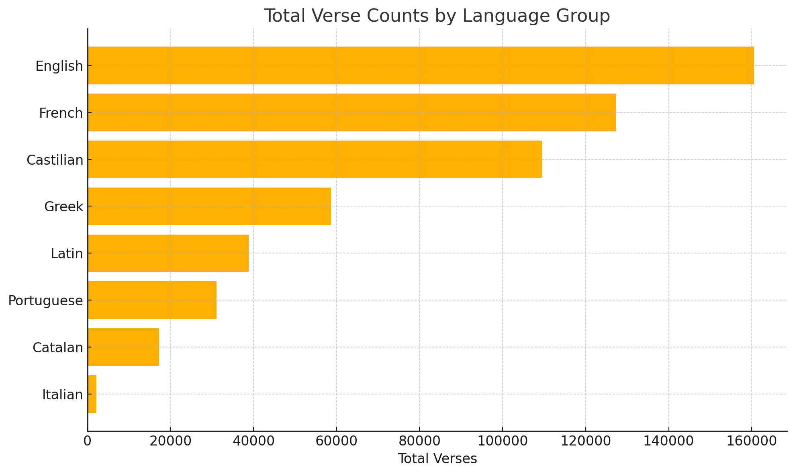

# 📈 Dataset Statistics Summary

This document presents a statistical overview of the **Parallelium** alignment dataset, including aligned verse counts, version-level coverage, and language distributions.

---

## 📖 Biblia Corpus

**Multilingual** — **3,927,811 pairs** across **42,562 aligned verses**

> 📌 The number of aligned pairs refers to verse-level combinations between two or more languages.  
> Each verse aligned between *N* languages generates *N choose 2* pairings.

---

## 🕋 Qur’anic Corpus

**Multilingual (Qur’an)** — **114,226 pairs** across **6,236 aligned verses**

> 📌 The number of aligned pairs refers to verse-level combinations between two or more languages.  
> Each verse aligned between *N* languages generates *N choose 2* pairings.

  

---

## 📊 Dataset Basic Stats

### 📑 Verse Counts by Version

> 📌 A "version" corresponds to a specific translation or manuscript tradition in a given language.

| Version ID        | Language     | Verses |
|-------------------|--------------|--------|
| gr_modern_greek   | Greek        | 31,060 |
| la_vulgate        | Latin        | 38,843 |
| fr_lsegond        | French       | 31,102 |
| fr_bible13        | French       |   702  |
| pt_almeida        | Portuguese   | 31,106 |
| es_arragel        | Castilian    | 22,652 |
| es_e6e8           | Castilian    | 31,247 |
| en_wycliffe       | English      | 36,248 |
| ca_peiresc        | Catalan      | 17,245 |
| en_bbe            | English      | 31,063 |
| en_coverdale      | English      | 31,086 |
| en_kjv            | English      | 31,059 |
| es_reina          | Castilian    | 31,065 |
| fr_jerusalem      | French       | 31,207 |
| it_alpha          | Italian      |  1,070 |
| fr_historiale     | French       |  2,241 |
| es_e3             | Castilian    | 24,515 |
| it_beta           | Italian      |  1,070 |
| gr_lxx            | Greek        | 27,616 |
| fr_perret         | French       | 31,102 |
| fr_epee           | French       | 30,933 |
| en_great          | English      | 31,108 |

---

### 🌐 Distribution by Language

The following plot summarizes the **total number of verses grouped by language**, aggregating across all available versions:

> 📌 This visualization complements the per-version table by offering a clearer view of data coverage **per language**, helping identify underrepresented areas or strong alignments.

  

---

## 🕋 Qur’anic Data

A multilingual alignment of the Qur’an (6,236 verses) was also used in model training. It includes **7 languages**, such as Arabic, English, French, Latin, and Italian. However, this data is **not included in the public release** due to redistribution restrictions.

> Qur’anic verses are structurally consistent and verse-aligned by design, contributing valuable contrast to biblical sources in the training setup.
